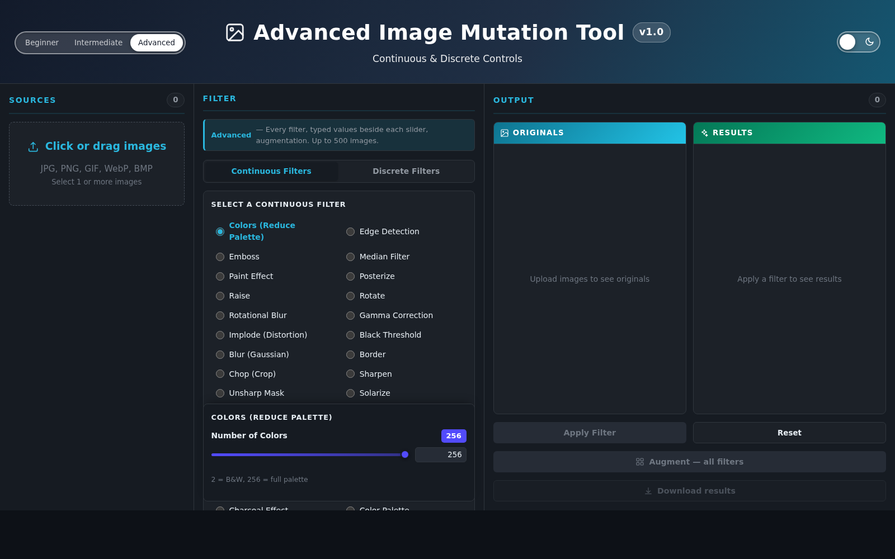
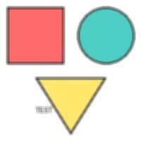
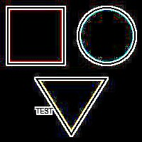
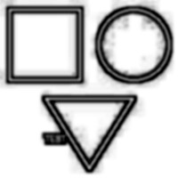
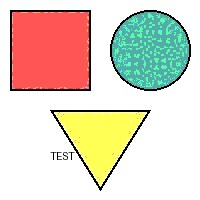
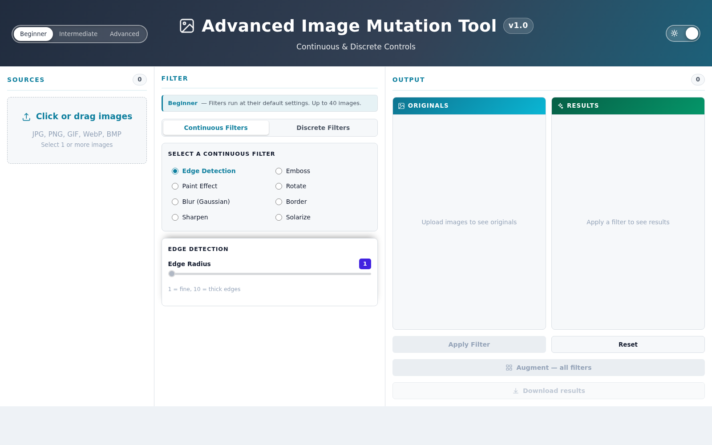

# Image-Augmentation

[](https://github.com/vaishnavkoka/Image-Augmentation/releases)
[](https://github.com/vaishnavkoka/Image-Augmentation/actions/workflows/tests.yml)
[](#operators)
[](#what-it-does)
[](#validation)
[](#what-it-does)
[](#validation)
[](#key-findings)
[](https://www.python.org/)
[](https://imagemagick.org/)
[](LICENSE)

**Image-Augmentation** is a deterministic image augmentation and mutation tool for
generating reproducible datasets. It applies configurable transformations and
controlled mutations to images, enabling researchers to systematically create
augmented datasets while ensuring the same input and configuration produce
identical outputs.

The operators are ImageMagick's, applied through a web interface or an HTTP API.
Output is byte-reproducible: the same image with the same parameters gives the
same bytes on every run, so a generated corpus can be reproduced rather than
archived.

Two related but distinct guarantees, worth separating because a paper may need
to cite either:

- **Against ImageMagick** — the tool's output is *pixel-identical* to the same
  operator run on the `magick` command line (61 of 62 comparisons, the remaining
  one within a single quantum). The PNG container may differ in compression, so
  the files are not byte-identical while the image data is.
- **Against itself** — the same input and parameters produce *byte-identical*
  files across runs, which is what makes a generated corpus reproducible.



---

## What it does

| | |
|---|---|
| Operators | **69** (49 continuous with a parameter, 20 discrete) |
| Configurations per image | **160**, of which 148 are distinct at default settings |
| Verified against | the ImageMagick command line — **61 of 62 pixel-identical**, 1 within one quantum |
| Output | byte-reproducible across runs |
| Interface | three modes (Beginner, Intermediate, Advanced) |
| Validation | **13 test suites**, one command |

## Operators

All 69 map to documented ImageMagick command-line options. The 20 added most
recently were each verified pixel-identical to their CLI form at the catalogue's
default parameter:

| Operator | ImageMagick option | Reference |
|---|---|---|
| `adaptive_blur` | `-adaptive-blur` | [docs](https://imagemagick.org/script/command-line-options.php#adaptive-blur) |
| `adaptive_sharpen` | `-adaptive-sharpen` | [docs](https://imagemagick.org/script/command-line-options.php#adaptive-sharpen) |
| `blue_shift` | `-blue-shift` | [docs](https://imagemagick.org/script/command-line-options.php#blue-shift) |
| `brightness_contrast` | `-brightness-contrast` | [docs](https://imagemagick.org/script/command-line-options.php#brightness-contrast) |
| `canny` | `-canny` | [docs](https://imagemagick.org/script/command-line-options.php#canny) |
| `kuwahara` | `-kuwahara` | [docs](https://imagemagick.org/script/command-line-options.php#kuwahara) |
| `magnify` | `-magnify` | [docs](https://imagemagick.org/script/command-line-options.php#magnify) |
| `modulate` | `-modulate` | [docs](https://imagemagick.org/script/command-line-options.php#modulate) |
| `motion_blur` | `-motion-blur` | [docs](https://imagemagick.org/script/command-line-options.php#motion-blur) |
| `ordered_dither` | `-ordered-dither` | [docs](https://imagemagick.org/script/command-line-options.php#ordered-dither) |
| `polaroid` | `-polaroid` | [docs](https://imagemagick.org/script/command-line-options.php#polaroid) |
| `roll` | `-roll` | [docs](https://imagemagick.org/script/command-line-options.php#roll) |
| `selective_blur` | `-selective-blur` | [docs](https://imagemagick.org/script/command-line-options.php#selective-blur) |
| `shade` | `-shade` | [docs](https://imagemagick.org/script/command-line-options.php#shade) |
| `sigmoidal_contrast` | `-sigmoidal-contrast` | [docs](https://imagemagick.org/script/command-line-options.php#sigmoidal-contrast) |
| `transpose` | `-transpose` | [docs](https://imagemagick.org/script/command-line-options.php#transpose) |
| `transverse` | `-transverse` | [docs](https://imagemagick.org/script/command-line-options.php#transverse) |
| `vignette` | `-vignette` | [docs](https://imagemagick.org/script/command-line-options.php#vignette) |
| `wavelet_denoise` | `-wavelet-denoise` | [docs](https://imagemagick.org/script/command-line-options.php#wavelet-denoise) |
| `white_threshold` | `-white-threshold` | [docs](https://imagemagick.org/script/command-line-options.php#white-threshold) |

`GET /api/mutations` returns the full catalogue of all 69 with every parameter's
range and default. `-spread` was deliberately excluded: it is random, which would
break reproducibility.

## Key findings

`experiments/origin_degradation.py` asks the question the tool exists to serve:
**which mutations destroy the evidence a provenance classifier relies on?**

The setup is a miniature of camera-origin classification. The same 100 synthetic
scenes are written through two pipelines — JPEG q92 4:4:4 against q78 4:2:0 — so
a classifier separating them can only be using processing traces: quantisation
artefacts, chroma subsampling, noise-residual statistics. Features are classic
forensic statistics rather than a CNN, which keeps the result about the
mutations rather than an architecture. A logistic-regression classifier reaches
**100% on unmutated images**. Chance is 50%.

| Family | n | Accuracy after mutation | Verdict |
|---|---|---|---|
| blur | 5 | 50% | destroyed |
| noise / denoise | 5 | 50% | destroyed |
| compression / palette | 3 | 50–100% | destroyed except `colors` |
| geometry | 5 | 50–100% | destroyed only by resampling |
| stylise | 6 | 31–100% | destroyed except tone-only styles |
| tone / contrast | 6 | 78–100% | partly degraded |
| sharpen | 3 | 100% | preserved |
| colour space | 3 | 100% | preserved |

**Mutations that touch spatial high-frequency content erase provenance
completely.** Every blur and every denoiser lands exactly on chance, as does
`resize`, which resamples. **Mutations that remap tone or colour without moving
pixels leave it fully intact** — `gamma`, `auto_level`, `modulate`, `grayscale`,
`colorspace` and `profile` all stay at 100%, as do the lossless geometric
operators, which only permute pixels. `charcoal` falls to **31%**, below chance,
so it inverts the trace rather than merely destroying it.

For anyone building a corpus, that is directly actionable: a robustness study
that mutates only with tone and colour operators is not testing provenance
robustness at all, because the evidence survives untouched.

Two cautions. The provenances are synthetic JPEG pipelines, not real camera
bodies, so this demonstrates the method rather than a camera-origin result. And
the 50% floor is a floor: once a family reaches chance, the task cannot rank its
members against each other.

## Requirements

- **Python 3.10 or newer** (developed on 3.12)
- **ImageMagick 7** *with the PNG, TIFF, WebP and freetype delegates*

That second requirement matters more than it looks. Without those delegates the
tool falls back to Pillow, which only *approximates* the ImageMagick operators,
and roughly half the catalogue becomes unavailable. Results produced that way are
not the operators the documentation names, so **`run.sh` refuses to start** on
such a build. `scripts/install-imagemagick.sh` builds a complete one without
root. If you understand the trade-off and want it anyway, use
`./run.sh --allow-degraded`, which prints what is degraded on every start.

## Quick start

```bash
./setup.sh          # virtualenv, dependencies, environment check
./run.sh            # API on :5000, interface on :3000
```

Then open <http://localhost:3000>.

```bash
python3 doctor.py   # diagnose delegates, fonts, ports
tests/run_all.sh    # all 13 validation suites
```

## Using the API

```bash
curl -X POST http://localhost:5000/api/mutate \
  -F 'image=@examples/input/sample.jpg' \
  -F 'mutation=blur' \
  -F 'parameters={"sigma":5}'
```

`GET /api/mutations` returns the catalogue with every parameter's range and
default, which is the authoritative list — the interface is built from it.

| Endpoint | Purpose |
|---|---|
| `GET /api/health` | engine, delegates, which formats are native |
| `GET /api/mutations` | the catalogue with parameter ranges |
| `POST /api/mutate` | apply one filter to one image |
| `GET /api/image/<file>` | view a result |
| `GET /api/download/<file>` | download a result |
| `POST /api/download-batch` | download several as a ZIP |

## Examples

One source image through eight operators — see `examples/`:

| blur | edge | charcoal | posterize |
|---|---|---|---|
|  |  |  |  |

## Experience modes

| Mode | Filters | Tuning | Image cap |
|---|---|---|---|
| Beginner | 8 common ones, defaults only | no | 40 |
| Intermediate | full catalogue, sliders | sliders | 40 |
| Advanced | full catalogue, typed values, augmentation | sliders + numeric entry | 500 |



## Repository organisation

```
Image-Augmentation/
├── README.md                   this file
├── CHANGELOG.md                what changed in each version
├── CITATION.cff                how to cite the tool
├── LICENSE                     MIT
├── requirements.txt            runtime dependencies
├── run.sh                      start the API and the interface
├── setup.sh                    build the virtualenv, check the environment
├── doctor.py                   diagnose delegates, fonts, ports
│
├── src/
│   ├── backend/                the engine
│   │   ├── app.py              Flask API, catalogue, all 69 operators
│   │   ├── mutation_worker.py  applies one mutation, in its own process
│   │   ├── worker_pool.py      keeps workers alive, replaces them when they die
│   │   └── .env.example        configuration template
│   └── ui/
│       ├── advanced-index.html single-file interface, no build step
│       ├── frontend_server.py  serves exactly two files, by allowlist
│       └── vendor/             jszip, for client-side ZIP downloads
│
├── configs/.env.example        copy to src/backend/.env to configure
├── assets/icc/                 49 bundled ICC profiles + provenance README
│
├── examples/
│   ├── input/                  sample source image
│   └── output/                 sample results, one per operator family
│
├── tests/                      13 validation suites
│   ├── run_all.sh              runs all of them, one command
│   ├── oracle_differential.py  pixel equality with the magick command line
│   ├── oracle_metamorphic.py   properties needing no reference
│   ├── oracle_formats.py       every format through every filter class
│   ├── oracle_suboptions.py    colorspaces, grayscale methods, profiles, dithers
│   ├── oracle_defaults.py      documented default == the one the UI sends
│   ├── adversarial.py          hostile input
│   ├── edge_cases.py           exotic images, parameter bounds, frames
│   ├── smoke_all_mutations.py  every operator still changes the image
│   ├── ui_wiring.py            every control maps to a catalogue entry
│   ├── augmentation_grid.py    all 160 configurations, end to end
│   ├── download_paths.py       downloads, batch ZIP, traversal refusal
│   ├── ui_behaviour.py         theme, numeric entry, caps, in a real browser
│   └── build_matrix.py         the catalogue on more than one ImageMagick
│
├── scripts/
│   ├── install-imagemagick.sh  build a complete ImageMagick without root
│   ├── package.sh              build a distributable archive
│   ├── restore-point.sh        whole-tree snapshot and rollback
│   └── rollback.sh             switch between interface versions
│
├── bench/                      throughput and library comparisons
├── experiments/                downstream provenance-classifier experiment
│
├── docs/
│   ├── DOCUMENTATION.md        full reference
│   ├── reports/                technical report and paper, with figures
│   └── screenshots/
│
└── .github/workflows/          CI: degraded-mode checks on every push
```

Created at runtime and not tracked: `outputs/`, `uploads/`, `src/backend/venv/`,
`src/backend/.env`, `dist/`.

### Where to start reading

| If you want to | Read |
|---|---|
| Use the tool | this README, then `docs/DOCUMENTATION.md` |
| Know what an operator does | `GET /api/mutations`, or the operator table above |
| Trust the output | `tests/oracle_differential.py` and `docs/reports/` |
| Change the engine | `src/backend/app.py`, then run `tests/run_all.sh` |
| Cite it | `CITATION.cff` |

## Validation

`tests/run_all.sh` runs everything:

| Suite | What it asserts |
|---|---|
| `oracle_differential` | pixel equality with the `magick` command line |
| `oracle_metamorphic` | properties needing no reference (involutions, identities, determinism) |
| `adversarial` | no input produces an error, hang or leak |
| `smoke_all_mutations` | every operator still changes the image |
| `oracle_formats` | every input format survives every filter class |
| `edge_cases` | hostile content, exotic images, parameter bounds, frames |
| `oracle_suboptions` | all 31 colorspaces, 9 grayscale methods, 50 profiles, 7 dither maps |
| `oracle_defaults` | the documented default is the one the interface sends |
| `ui_wiring` | every control maps to a real catalogue entry |
| `augmentation_grid` | all 160 configurations apply, and how many are distinct |
| `download_paths` | downloads, batch ZIP, traversal refusal |
| `ui_behaviour` | theme, numeric entry, upload caps, in a real browser |
| `build_matrix` | the catalogue on more than one ImageMagick, and that none crashes the server |

## Datasets

Generated corpora are **not distributed**. The tool is byte-reproducible, so the
same inputs and parameters reproduce a corpus exactly, which is a stronger
guarantee than a hosted copy. Record the ImageMagick version and the parameter
grid alongside any published result.

## Known limitations

- **Fidelity depends on the ImageMagick build.** Byte-equality with the command
  line was established against **ImageMagick 7.1.1-41 Q16-HDRI**. Q16 and
  Q16-HDRI round differently for operators such as `edge` and `emboss`. Pin the
  build when publishing.
- **Eight of the 160 configurations return the input unchanged at default slider
  positions** — `median` at kernel 1 and `gamma` at 1.0 are the identity, and
  `profile` Strip is a no-op on an untagged sRGB source. A default augmentation
  run yields **148 distinct images**. Moving a slider makes its configuration a
  real mutation.
- **`annotate` and `colorize` are reachable only through the API.** Neither fits
  the single-slider pattern, so the catalogue holds 69 operators while the
  interface reaches 67.
- **JPEG output is re-encoded**, adding compression loss on top of the mutation.
  Prefer PNG for research output, or set `JPEG_QUALITY=100`.
- **Flask's development server** runs the backend, and there is no
  authentication or rate limiting. It is a research tool, not a public service.

## Citing

If you use this tool in research, cite it via `CITATION.cff` — GitHub renders a
ready-made citation from it under **Cite this repository** on the repository
page. Record the ImageMagick version and the parameter grid alongside any
published result, since byte-equality is specific to a build.

## Changelog

See [CHANGELOG.md](CHANGELOG.md). Releases are tagged, so a specific version can
be checked out and reproduced:

```bash
git checkout v1.2.0
```

## Licence

MIT — see [LICENSE](LICENSE).

### Third-party content

`assets/icc/` bundles 49 ICC profiles that are **not** covered by the MIT licence
above: 23 from Debian's `colord-data` under **CC0**, and 13 from Ghostscript under
**Expat/MIT** with the SunSoft exception. Both permit redistribution. Provenance
for every file is recorded in `assets/README.md`.
